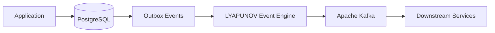
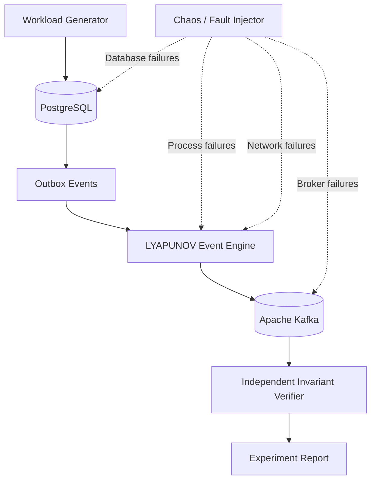

# LYAPUNOV

### Distributed Event Reliability & Fault-Verification Platform

> A distributed event delivery system that tests message reliability, ordering, and recovery under real-world failures.

[](https://www.oracle.com/java/)
[](https://www.postgresql.org/)
[](https://kafka.apache.org/)
[](https://www.docker.com/)
[](https://www.linux.org/)

---

## Overview

Modern backend systems often use asynchronous events to keep services in sync.

The difficult part is what happens when something fails between those services.

A database transaction may succeed while a message broker is temporarily unavailable. A worker may crash during delivery. A network connection may disappear halfway through a request. A broker may restart while events are being processed.

These failures can leave distributed systems in an inconsistent state even when individual services appear healthy.

**LYAPUNOV** is being built to explore and verify these failure scenarios.

The project combines a **transactional event delivery engine** with an independent **fault-injection and verification system**. Instead of testing only the normal path, LYAPUNOV deliberately introduces failures and checks whether the system recovers while preserving its defined delivery guarantees.

The name comes from **Aleksandr Lyapunov**, whose work on stability examines how systems behave when they are disturbed.

---

## The Problem

A common backend design performs two independent operations:

```text
Application
     │
     ├──────────────► PostgreSQL
     │                    │
     │                 COMMIT ✓
     │
     └──────────────► Kafka
                          │
                       FAILURE ✗
```

If the database update succeeds but the event publish fails, the database and downstream services can disagree.

This is commonly referred to as the **dual-write problem**.

LYAPUNOV uses the **Transactional Outbox Pattern** to make the database transaction the durable source of the event.



The application writes its business change and the corresponding outbox event in the same database transaction.

The LYAPUNOV engine then reads those persisted events and attempts to deliver them to Kafka.

---

## What LYAPUNOV Does

The project has three main parts.

### 1. Event Delivery Engine

The core Java service responsible for reading durable outbox events and publishing them to Kafka.

It is designed around:

* PostgreSQL `SELECT ... FOR UPDATE SKIP LOCKED`
* Concurrent event processing
* Worker leases
* Retry and exponential backoff
* Per-aggregate ordering
* Kafka acknowledgements
* Dead-letter handling
* Crash recovery

The initial delivery model is **at-least-once delivery**.

That distinction matters.

A crash after Kafka accepts an event but before the database state is updated can result in the same event being published again.

LYAPUNOV treats this as a behavior to measure and verify rather than pretending that duplicates cannot happen.

---

### 2. Fault Injection Engine

The system will deliberately introduce failures while events are being processed.

Planned failure scenarios include:

* Process termination
* Kafka connectivity failures
* PostgreSQL connectivity failures
* Network interruptions
* Delayed responses
* Worker failures
* Poison or malformed events

The purpose of the fault injector is simple:

> **Break the system in controlled ways and observe what happens next.**

---

### 3. Independent Verification Engine

A separate consumer observes the resulting Kafka stream and verifies the behavior of the system.

It will check:

* Missing events
* Duplicate deliveries
* Per-aggregate ordering
* Dead-letter behavior
* Recovery time
* Throughput during failures
* Successful recovery after process crashes

The verifier is intentionally independent from the delivery engine.

The system should not simply say:

> "I delivered everything correctly."

The verifier should be able to examine the resulting stream and determine whether that statement is actually true.

---

# System Architecture



---

## Event Lifecycle

A simplified event lifecycle looks like this:

```text
CREATED
   │
   ▼
PERSISTED
   │
   ▼
CLAIMED
   │
   ▼
PUBLISHED
   │
   ▼
ACKNOWLEDGED
   │
   ▼
COMPLETED
```

If the worker fails before completion:

```text
CLAIMED
   │
   │  process crash
   ▼
LEASE EXPIRES
   │
   ▼
RE-CLAIMED
   │
   ▼
RETRIED
   │
   ▼
PUBLISHED
```

The important part is that the event remains durable in PostgreSQL until the delivery process has successfully completed its required acknowledgement flow.

---

# Reliability Model

LYAPUNOV is built around **at-least-once delivery**.

The system is not designed to make the unrealistic claim that an event can never be delivered twice.

Instead, the verification layer measures what happens during failure and recovery.

For an aggregate with monotonically increasing sequence numbers:

```text
Expected:

1 → 2 → 3 → 4 → 5 → 6 → 7 → ...

```

The verifier checks for:

```text
Missing sequence
1 → 2 → 4 → 5
        ↑
      missing 3

Ordering violation
1 → 2 → 4 → 3 → 5
            ↑
        out of order

Duplicate replay
1 → 2 → 3 → 3 → 4
            ↑
        duplicate
```

Duplicates may occur during crash recovery under at-least-once delivery.

Missing events and ordering violations are treated as correctness failures for the relevant experiment.

---

# Core Technical Components

## PostgreSQL Outbox

The application writes the business mutation and event record within the same database transaction.

Conceptually:

```sql
BEGIN;

UPDATE business_table
SET ...

INSERT INTO outbox_events (...);

COMMIT;
```

The event is therefore persisted together with the business state change.

---

## Concurrent Polling

Multiple workers will use PostgreSQL row locking to safely process available events concurrently.

The planned polling mechanism uses:

```sql
SELECT ...
FROM outbox_events
WHERE status = 'PENDING'
ORDER BY created_at
FOR UPDATE SKIP LOCKED
LIMIT ?;
```

`SKIP LOCKED` allows workers to avoid waiting on rows already claimed by another worker.

---

## Worker Leases

Workers will use time-bounded ownership of events or partitions.

If a worker disappears unexpectedly, its ownership can expire and another worker can recover the work.

This is important for handling failures such as:

```text
Worker A
   │
   ├── claims work
   │
   X── process crashes
   │
   ▼
Lease expires
   │
   ▼
Worker B
   │
   └── recovers work
```

---

## Kafka Delivery

The event engine will publish events to Kafka using explicit producer acknowledgement settings.

Per-aggregate ordering will be maintained by consistently routing events belonging to the same aggregate to the same Kafka partition.

For example:

```text
user-101 → partition 2
user-205 → partition 0
user-314 → partition 1
user-101 → partition 2
```

This allows the sequence of events belonging to one aggregate to remain ordered within that partition.

---

## Retry and Backoff

Transient failures should not immediately become permanent failures.

The engine will use retry attempts with exponential backoff and jitter.

Conceptually:

```text
Attempt 1
   │
   └── failure
        │
        ▼
      wait
        │
Attempt 2
   │
   └── failure
        │
        ▼
      longer wait
        │
Attempt 3
   │
   └── success
```

Persistent failures can eventually be routed to the Dead-Letter Queue.

---

# Chaos Testing

Normal tests answer:

> Does the system work?

LYAPUNOV's chaos experiments ask:

> What happens when the system stops working normally?

Planned experiments include:

### Process Failure

```text
Generate events
      ↓
Start relay
      ↓
Process events
      ↓
SIGKILL relay
      ↓
Recover
      ↓
Verify stream
```

### Network Failure

```text
Producer
   │
   X
   │
Kafka

Network connection interrupted
        ↓
Retry
        ↓
Recovery
        ↓
Verification
```

### Broker Failure

The experiment will temporarily make Kafka unavailable while events continue to accumulate in the durable outbox.

The engine should recover once the broker becomes available again.

### Database Failure

Database connectivity interruptions will be introduced to observe how the polling and recovery logic behaves.

---

# Verification

Every experiment should produce measurable results.

The verifier will compare:

```text
Expected Events
       │
       ▼
Database / Workload Record
       │
       │
       ▼
Actual Kafka Stream
       │
       ▼
Invariant Checks
```

The main invariants are:

| Invariant        | What it checks                                         |
| ---------------- | ------------------------------------------------------ |
| Completeness     | No expected event disappears from the resulting stream |
| Ordering         | Events for the same aggregate remain in sequence       |
| Duplicate replay | Measures repeated deliveries during recovery           |
| DLQ isolation    | Poison events do not block unrelated events            |
| Recovery         | Measures how quickly normal processing resumes         |

---

# Experiment Report

Actual benchmark values will be generated by the project.

The final report will follow a format similar to:

```text
============================================================
                 LYAPUNOV EXPERIMENT REPORT
============================================================

Workload
------------------------------------------------------------
Events generated:          <measured>
Events committed:          <measured>
Events delivered:          <measured>

Invariant Verification
------------------------------------------------------------
Missing events:            <measured>
Ordering violations:      <measured>
Duplicate deliveries:     <measured>
DLQ events:                <measured>

Fault Injection
------------------------------------------------------------
Process failures:          <measured>
Network failures:          <measured>
Broker failures:           <measured>

Recovery
------------------------------------------------------------
Recovery time:             <measured>
Peak throughput:           <measured>
Fault-state throughput:    <measured>

============================================================
```

No benchmark number will be included in the documentation until it has actually been measured.

---

# Technology Stack

| Component           | Technology              |
| ------------------- | ----------------------- |
| Language            | Java 21                 |
| Database            | PostgreSQL 16+          |
| Message Broker      | Apache Kafka 3.7+       |
| Containers          | Docker / Docker Compose |
| Systems Tooling     | Linux                   |
| Build               | Maven Wrapper           |
| Unit Testing        | JUnit 5                 |
| Integration Testing | Testcontainers          |
| Version Control     | Git                     |

---

# Project Structure

The repository will evolve toward a structure similar to:

```text
lyapunov/
│
├── src/
│   ├── main/
│   │   └── java/
│   │       └── com/
│   │           └── lyapunov/
│   │
│   └── test/
│       └── java/
│           └── com/
│               └── lyapunov/
│
├── docker/
│
├── scripts/
│   ├── chaos/
│   └── benchmark/
│
├── docs/
│   ├── architecture/
│   └── experiments/
│
├── pom.xml
├── README.md
└── .gitignore
```

Directories and components will be added as they become part of the implementation.

---

# Development Roadmap

### Phase 1 — Foundation

* [x] Project concept and architecture
* [ ] Java 21 Maven project
* [ ] Maven Wrapper
* [ ] Docker Compose environment
* [ ] PostgreSQL setup
* [ ] Kafka setup

### Phase 2 — Event Engine

* [ ] Outbox schema
* [ ] Event persistence
* [ ] Basic polling
* [ ] Kafka producer
* [ ] Kafka acknowledgements
* [ ] Event completion handling

### Phase 3 — Reliability

* [ ] Concurrent workers
* [ ] `SKIP LOCKED`
* [ ] Worker leases
* [ ] Retry policy
* [ ] Exponential backoff
* [ ] Per-aggregate ordering
* [ ] Dead-Letter Queue

### Phase 4 — Verification

* [ ] Workload generator
* [ ] Independent Kafka consumer
* [ ] Sequence tracking
* [ ] Missing-event detection
* [ ] Duplicate detection
* [ ] Ordering verification
* [ ] Recovery-time measurement

### Phase 5 — Chaos Engineering

* [ ] Process crash injection
* [ ] Network failure injection
* [ ] Kafka failure scenarios
* [ ] PostgreSQL failure scenarios
* [ ] Poison-event experiments
* [ ] Automated experiment runs

### Phase 6 — Benchmarking

* [ ] Throughput benchmarks
* [ ] Latency measurements
* [ ] Recovery measurements
* [ ] Duplicate-replay analysis
* [ ] Reproducible experiment reports

---

# Engineering Goals

LYAPUNOV is being built around a few simple principles:

### Correctness before performance

A fast event system that loses or reorders data is not useful.

### Failures are test cases

Crashes, network interruptions, and broker failures are treated as part of the system's operating environment.

### Measure instead of assume

Reliability claims should come from reproducible experiments rather than assumptions.

### Keep verification independent

The component responsible for delivering events should not be the only component deciding whether delivery was correct.

### Start simple

The first version focuses on a well-defined PostgreSQL → Kafka event pipeline before introducing unnecessary distributed complexity.

---

# Why This Project?

Most event-driven systems are evaluated on their happy path.

LYAPUNOV focuses on the harder question:

> **What happens to event correctness when the system is under failure?**

The project is an attempt to answer that question with an actual implementation, controlled failures, independent verification, and measurable results.

---

# Status

**Early development**

The repository currently contains the project foundation. Implementation, experiments, and benchmark results will be added incrementally.

---

## License

License information will be added with the first open-source release.


